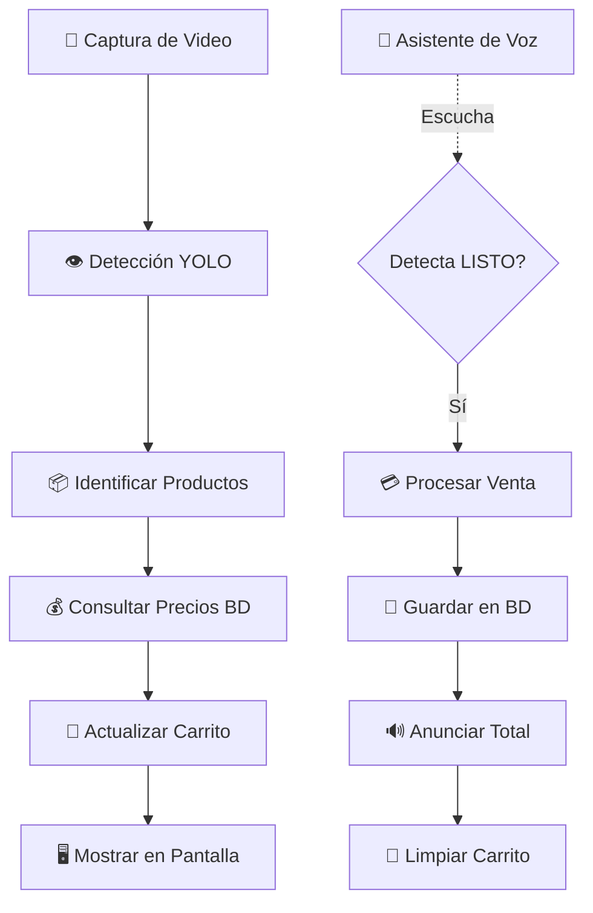

# Sistema de Punto de Venta con IA - Bazar Gulpery 🛍️

Sistema automatizado de punto de venta que utiliza **YOLOv11** para detectar productos, **PostgreSQL** para gestión de precios, y un **Asistente de Voz** para interacción natural.

---

## 🌟 Características Principales

### 1️⃣ Detección de Productos con IA
- **Modelo:** YOLOv11 entrenado con 9 clases de productos
- **Precisión:** Detección en tiempo real con filtrado de estabilidad
- **Visualización:** Bounding boxes con nombres y precios

### 2️⃣ Gestión de Inventario
- **Base de Datos:** PostgreSQL con pool de conexiones
- **Tablas:** `inventario` y `historial_ventas`
- **Funciones:** CRUD completo, registro de ventas, estadísticas

### 3️⃣ Asistente de Voz Interactivo
- **Reconocimiento:** Speech Recognition con Google API
- **Síntesis:** pyttsx3 para texto-a-voz en español
- **Comando:** Di "LISTO" para finalizar compra automáticamente

### 4️⃣ Interfaz Visual Completa
- **Carrito dinámico:** Muestra productos detectados en tiempo real
- **Precios:** Integrados desde base de datos
- **Estadísticas:** FPS, conteo de productos, estado del sistema

---

## 📋 Productos Detectables

El sistema está entrenado para detectar los siguientes productos:

1. 🐋 Borrador de ballena
2. 🧜 Borrador de sirena
3. 🖊️ Esfero Negro
4. 💾 Flash Kingston 4GB
5. 💾 Flash Verbatim 16Gb
6. 🎀 Pasador Cabello Minimouse
7. ✨ Resaltador
8. 👛 Cartera
9. 🌸 Perfume

---

## 🏗️ Arquitectura del Proyecto

```
cnn_proyect/
│
├── app.py                  # 🎯 Aplicación principal (Sistema POS)
├── config.py               # ⚙️ Configuraciones centralizadas
├── database.py             # 🗄️ Gestor de base de datos PostgreSQL
├── detector.py             # 👁️ Detector YOLO y captura de video
├── voice_assistant.py      # 🎤 Asistente de voz (STT y TTS)
├── ui.py                   # 🖥️ Interfaz visual y carrito de compras
│
├── init_database.py        # 🔧 Script de inicialización de BD
├── train_model.py          # 🧠 Script de entrenamiento del modelo
│
├── best.pt                 # 🎯 Modelo YOLO entrenado
├── requirements.txt        # 📦 Dependencias del proyecto
└── README.md               # 📖 Este archivo
```

---

## 🚀 Instalación y Configuración

### Paso 1: Requisitos Previos

1. **Python 3.8+**
2. **PostgreSQL 12+** (instalado y corriendo)
3. **Cámara IP** o webcam
4. **Micrófono** para asistente de voz

### Paso 2: Clonar e Instalar Dependencias

```bash
# Clonar o navegar al directorio del proyecto
cd d:\cnn_proyect

# Crear entorno virtual (recomendado)
python -m venv venv
venv\Scripts\activate  # En Windows
# source venv/bin/activate  # En Linux/Mac

# Instalar dependencias
pip install -r requirements.txt
```

### Paso 3: Configurar PostgreSQL

1. Asegúrate de que PostgreSQL esté corriendo
2. Verifica las credenciales en [config.py](config.py):
   ```python
   DATABASE_CONFIG = {
       'host': 'localhost',
       'port': 5432,
       'user': 'postgres',
       'password': 'gulpery',  # ⚠️ Cambia esto
       'database': 'bazar_gulpery'
   }
   ```

3. Inicializa la base de datos:
   ```bash
   python init_database.py
   ```

### Paso 4: Configurar Cámara

Edita la URL de la cámara en [config.py](config.py):

```python
CAMERA_CONFIG = {
    'source': 'http://192.168.100.11:8080/video',  # O usa 0 para webcam
    ...
}
```

---

## ▶️ Uso del Sistema

### Ejecutar el Sistema POS

```bash
python app.py
```

### Controles del Teclado

| Tecla | Acción |
|-------|--------|
| `ESC` | Salir del sistema |
| `C` | Limpiar carrito manualmente |
| `V` | Activar/desactivar asistente de voz |

### Comandos de Voz

| Comando | Acción |
|---------|--------|
| **"LISTO"** | Finaliza la compra y anuncia el total |
| *"AYUDA"* | Muestra comandos disponibles |
| *"ESTADO"* | Informa estado del sistema |

---

## 🧠 Entrenamiento del Modelo (Opcional)

Si deseas reentrenar el modelo:

```bash
# Ejecutar en Google Colab o entorno con GPU
python train_model.py
```

El script:
1. Descarga el dataset desde Roboflow
2. Entrena YOLOv11 por 250 épocas
3. Genera `best.pt` con el mejor modelo

**Dataset:**
- **Workspace:** bazarmg
- **Proyecto:** my-first-project-fiobt
- **Versión:** 2

---

## 📊 Flujo de Funcionamiento



---

## 🛠️ Módulos del Sistema

### 1. `config.py` - Configuración
- Credenciales de base de datos
- Parámetros del modelo YOLO
- Configuración de cámara y voz
- Clases de productos

### 2. `database.py` - Gestor de BD
**Clases:**
- `DatabaseManager`: Pool de conexiones PostgreSQL
  - `get_product_by_name()`: Obtiene precio de producto
  - `register_sale()`: Registra venta en historial
  - `get_sales_history()`: Consulta ventas

### 3. `detector.py` - Detección YOLO
**Clases:**
- `ProductDetector`: Inferencia con YOLOv11
  - `detect()`: Detecta productos en frame
  - `_stabilize_detections()`: Filtro de estabilidad
  - `count_products()`: Cuenta productos únicos

- `VideoCapture`: Captura con reconexión automática

### 4. `voice_assistant.py` - Asistente de Voz
**Clases:**
- `VoiceAssistant`: STT y TTS
  - `listen_once()`: Escucha comando
  - `speak()`: Pronuncia texto
  - `announce_sale()`: Anuncia venta completa

### 5. `ui.py` - Interfaz Visual
**Clases:**
- `UIRenderer`: Renderizado de UI
  - `draw_detection_info()`: Dibuja bounding boxes
  - `draw_shopping_cart()`: Muestra carrito
  - `draw_status_bar()`: Barra de estado

- `ShoppingCart`: Lógica del carrito
  - `update()`: Actualiza con detecciones
  - `get_total()`: Calcula total

### 6. `app.py` - Sistema Principal
**Clase:**
- `POSSystem`: Coordinador del sistema
  - `_process_frame()`: Pipeline de procesamiento
  - `_handle_checkout()`: Maneja finalización de compra
  - `run()`: Loop principal

---

## 🔒 Seguridad y Mejores Prácticas

### ⚠️ Producción
1. **Cambiar contraseñas** en `config.py`
2. **Usar variables de entorno** para credenciales:
   ```python
   import os
   password = os.getenv('DB_PASSWORD')
   ```
3. **SSL** para conexiones de base de datos
4. **Validar entradas** de usuarios

### 🚀 Optimización
- Usar GPU para inferencia YOLO más rápida
- Ajustar `confidence_threshold` según precisión deseada
- Implementar caché de precios en memoria

---

## 📈 Extensiones Futuras

- [ ] Dashboard web con estadísticas de ventas
- [ ] Integración con métodos de pago
- [ ] Notificaciones de stock bajo
- [ ] Multi-cámara para cobertura completa
- [ ] App móvil para administración
- [ ] Exportación de reportes en PDF/Excel

---

## 🐛 Solución de Problemas

### Error: "No se puede conectar a PostgreSQL"
```bash
# Verificar que PostgreSQL esté corriendo
sudo service postgresql status  # Linux
# O revisar servicios en Windows
```

### Error: "No se puede abrir la cámara"
- Verifica que la URL sea correcta
- Para webcam local, usa `source: 0`
- Comprueba permisos de cámara

### Error: "ModuleNotFoundError"
```bash
pip install -r requirements.txt --force-reinstall
```

### Error en reconocimiento de voz
- Verifica conexión a Internet (usa Google API)
- Comprueba permisos de micrófono
- Calibra ruido ambiente

---

## 👨‍💻 Autor

**Arquitecto de Soluciones de IA**  
Sistema desarrollado para Bazar Gulpery  
Versión 2.0 - 2025

---

## 📄 Licencia

Este proyecto es privado y confidencial. Todos los derechos reservados.

---

## 🙏 Agradecimientos

- **Ultralytics** por YOLO
- **Roboflow** por herramientas de dataset
- **OpenCV** por procesamiento de visión
- **PostgreSQL** por base de datos robusta

---

## 📞 Soporte

Para soporte técnico o consultas:
- 📧 Email: [soporte@bazargulpery.com]
- 📱 Tel: [+593-XXX-XXXX]

---

**¡Gracias por usar nuestro sistema! 🎉**
